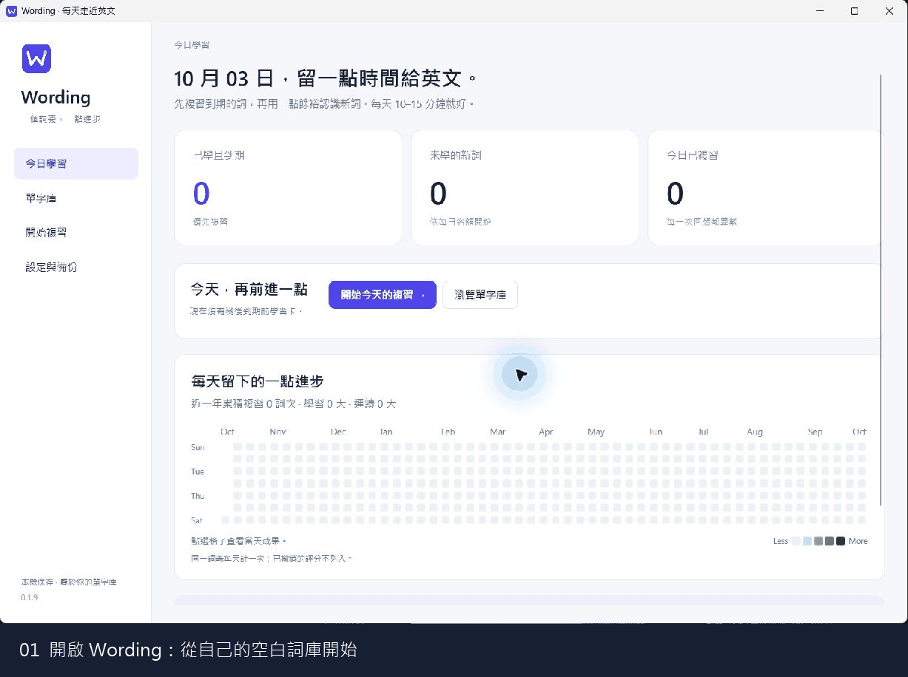

# Wording

**一個詞義，一點進步。**

Windows 英文單字學習 App，將自己的詞庫、雙語例句與 FSRS 間隔複習放在一起。以 C#、WPF 與 SQLite 開發，資料保存在本機；新安裝從空白詞庫開始，可自行新增或匯入 TOEIC 學習詞彙。

[下載程式](https://github.com/ming0071/Wording/releases) · [選用單字庫](content/toeic-vocabulary.json) · [文件](#documentation) · [Build & Tests](https://github.com/ming0071/Wording/actions)

## Features

- **間隔複習**：到期卡優先，依每日新詞設定提供新卡；可選擇一個或多個主題。
- **自己的單字庫**：多詞義、中英文解釋、雙語例句、搭配、同義詞與學習筆記。
- **收藏與整理**：星號、主題篩選，以及建立時間、字母或熟練程度排序。
- **鍵盤與發音**：空白鍵翻卡、1–4 評分、S／E 朗讀；支援自訂按鍵與自動朗讀。
- **每日成果**：近一年的複習熱力圖、每日詞義數與連續學習天數。
- **情境練習**：用自己的單字生成閱讀與聽力、英文選擇題和中文解析；個別單字回饋可更新到期或未學詞義的排程。
- **字典與 AI**：內嵌字典查閱，Codex 產生內容後先預覽，再決定是否套用。
- **資料可攜**：單字 JSON 匯入／匯出，完整詞庫與複習紀錄 ZIP 備份。

## Installation

### Windows 程式包

使用 Windows 11 x64，從 [Releases](https://github.com/ming0071/Wording/releases) 下載 Windows x64 ZIP，完整解壓後執行 `Wording.exe`。程式包已包含 .NET，不需另外安裝。

內嵌字典需要 Microsoft Edge WebView2 Runtime。

### 從原始碼執行

需要 Windows 11 x64、Git 與 **.NET 10 SDK**。在 PowerShell 執行：

```powershell
git clone https://github.com/ming0071/Wording.git
cd Wording
.\scripts\build.ps1
.\src\Wording.Desktop\bin\Release\net10.0-windows\Wording.exe
```

`build.ps1` 包含建置與測試；後續直接開啟 EXE。

## Usage

**匯入單字庫 → 篩選主題 → 翻卡與評分 → 查看學習成果**



### Getting Started

1. 到「單字庫」新增詞義，或在「設定與備份」匯入 [toeic-vocabulary.json](content/toeic-vocabulary.json)（1,323 個詞義、8 個主題，含例句、學習筆記與星號）。新安裝的詞庫為空，教材需自行匯入。
2. 按「開始複習」，選擇一個或多個主題；未篩選時使用全部單字庫。
3. 先回想答案，按空白鍵翻卡，再用 1–4 評分。預設 S 讀單字、E 讀例句，可在設定更改。
4. 到「今日學習」查看複習成果與熱力圖；每日新詞上限可在「設定與備份」調整。

### Review

1 重來、2 困難、3 良好、4 簡單，依這次能否想起答案評分。新詞第一次選 3，會在 **10 分鐘後**再複習；到期後再次選 3，便進入以天計算的長期排程。後續間隔由 FSRS 依每個詞義的評分與複習歷史計算，評分後會顯示下一次複習時間。

每日預設加入 5 個新詞，所有主題共用名額；到期複習較多時會減少新詞。完整規則見 [評分與複習排程](docs/review-scheduling.md)。

### Scenario Practice

到「情境練習」切換閱讀或聽力，選主題、文章長度和難度，生成單篇內容與 3–5 題選擇題。也可以選「有趣的文章」，讓單字出現在輕鬆故事、科幻或奇幻情境中。

提交後才顯示中文解析與聽力逐字稿；依自己是否理解個別單字評分，到期詞義會更新 FSRS，未學新詞使用每日新詞名額。當次未提交內容可跨頁保留，最近三個月的練習以主題色塊與次數呈現，方便比較哪些主題練習較多或較少。選項、選字方式與提示詞調整見 [閱讀與聽力情境練習](docs/scenario-practice.md)。

### Data

| 格式 | 適合用途 |
| --- | --- |
| 單字 JSON | 分享、編輯或擴充詞彙，包含星號，不含複習進度 |
| 備份 ZIP | 保存完整詞庫與複習紀錄；還原時整庫替換 |

資料的實際位置可在「設定與備份」查看。ZIP 保存單字與複習資料庫，個人設定另存於 `settings.json`。檔案欄位與匯入規則見 [JSON 格式與檔案操作](docs/vocabulary-files.md)。

### Codex（選用）

安裝 Codex CLI 並完成登入，再到 App 設定頁指定執行檔並檢查連線。

```powershell
codex login
codex login status
```

生成使用自己的 Codex 訂閱額度；一般單字管理與複習可離線使用。Windows 朗讀使用電腦上的英文合成語音。

## Tests

在專案根目錄執行：

```powershell
.\scripts\test.ps1
```

測試使用獨立資料庫，不會修改自己的單字庫。CI 另檢查鎖定還原、Windows 發行包與 SHA-256；本機驗證方式與待評估優化見 [品質檢查與維護](docs/quality-checks.md)。

## Project Structure

```text
Wording/
├── src/
│   ├── Wording.Core/             # 資料模型與服務契約
│   ├── Wording.Infrastructure/   # SQLite、FSRS、備份、Codex、語音
│   └── Wording.Desktop/          # WPF 畫面、ViewModel 與操作
├── content/                     # 選用教材與 JSON 範例
├── docs/                        # 使用說明、排程驗證、GIF 與授權
├── scripts/                     # 建置、測試、打包與詞庫檔案工具
├── tests/
│   └── Wording.Tests/           # 自動測試與參考資料
├── .github/workflows/           # Windows CI
├── Wording.sln
└── README.md
```

## Documentation

| 文件 | 內容 |
| --- | --- |
| [評分與複習排程](docs/review-scheduling.md) | 1–4 評分、新詞學習步驟、長期複習與每日新詞名額 |
| [閱讀與聽力情境練習](docs/scenario-practice.md) | 生成選項、選字、中文解析、單字回饋與提示詞調整 |
| [JSON 格式與檔案操作](docs/vocabulary-files.md) | 資料位置、欄位、穩定 ID 與匯入／匯出指令 |
| [教材說明](content/README.md) | 選用詞庫、主題、星號與教材維護 |
| [桌面介面導覽](src/Wording.Desktop/README.md) | 畫面、操作流程、共用樣式與介面測試 |
| [FSRS 參考驗證](docs/FSRS_VERIFICATION.md) | 排程參數、套件差異與參考資料重建 |
| [品質檢查與維護](docs/quality-checks.md) | CI、發行驗證、歷史檔案判斷與後續優化 |
| [版本發布](docs/releases/README.md) | tag 自動發布、附件驗證與草稿重試 |
| [第三方授權](THIRD_PARTY_NOTICES.md) | 相依套件的授權與來源 |
