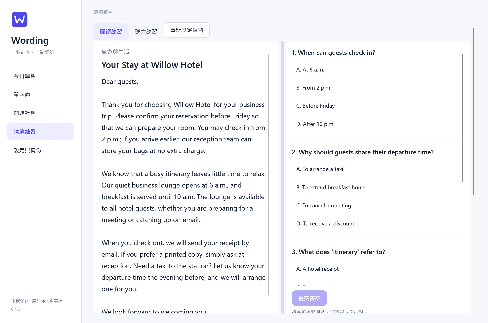
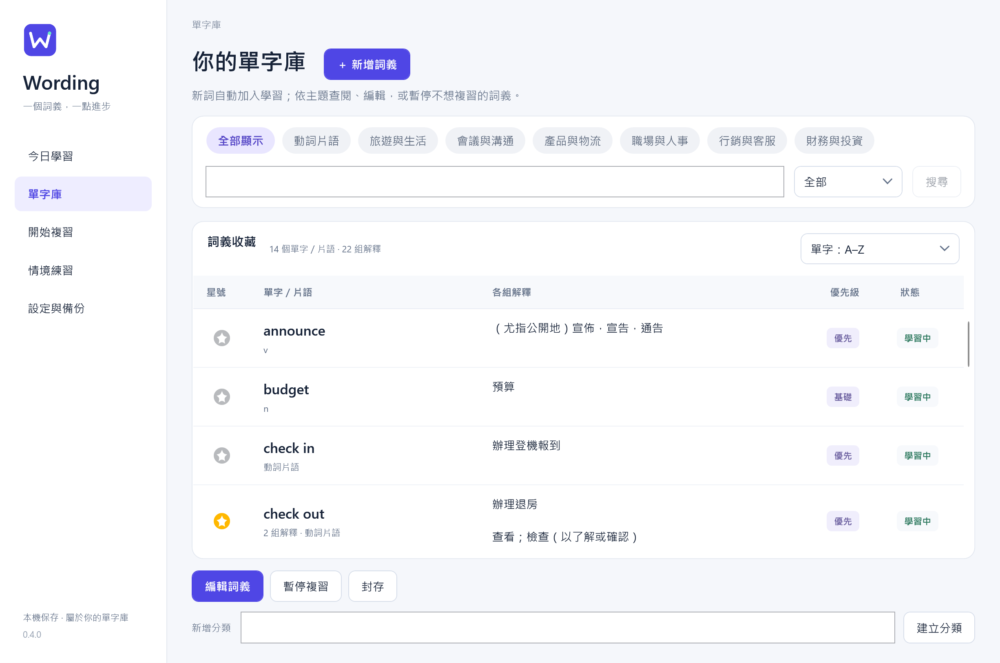
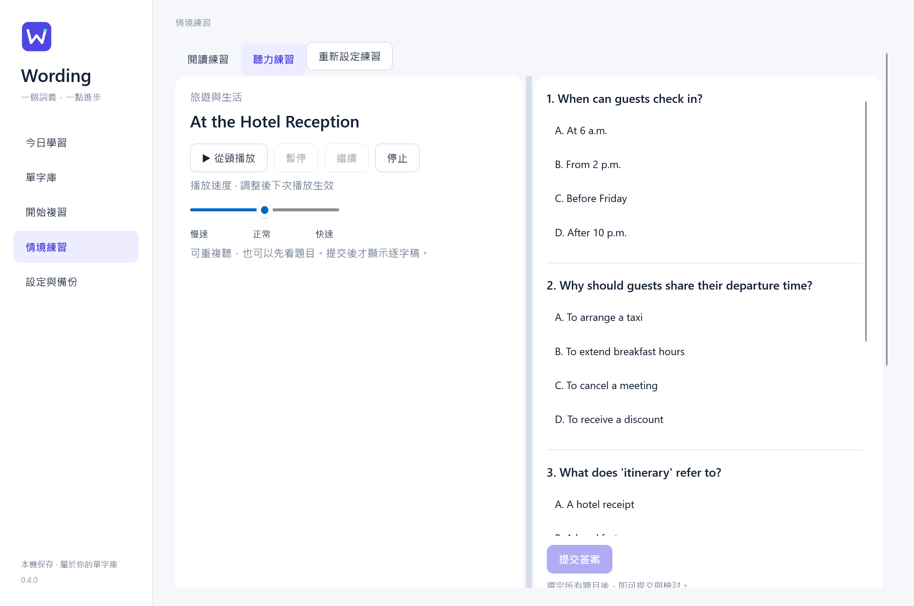

# Wording

**一個詞義，一點進步。**

Windows 英文學習 App，把自己的詞庫、FSRS 間隔複習，以及 **Codex 閱讀／聽力情境測驗**放在一起。用不熟悉的單字讀一篇、聽一段，再透過英文選擇題與中文解析練習理解。以 C#、WPF 與 SQLite 開發，資料保存在本機。

[下載程式](https://github.com/ming0071/Wording/releases) · [選用單字庫](content/toeic-vocabulary.json) · [文件](#documentation) · [Build & Tests](https://github.com/ming0071/Wording/actions)

## Features

- **Codex 情境測驗**：依自己的詞庫生成文章、對話或獨白，搭配 3–5 題英文選擇題；可選主題、長度、難度，也能練習輕鬆故事、科幻與奇幻。
- **作答與檢討**：提交後顯示分數、中文解析與原文依據；聽力逐字稿提交後才出現。個別單字回饋可更新符合資格詞條的 FSRS 排程。
- **間隔複習**：到期卡優先，每日預設 25 個新詞；空白鍵翻卡、1–4 評分、S／E 朗讀，支援自訂按鍵。
- **自己的單字庫**：多組解釋共用一個星號與複習卡；保存雙語例句、搭配、同義詞與筆記，可依主題、字母或熟練程度整理。
- **學習足跡**：每日複習熱力圖與連續學習天數；情境練習另顯示最近三個月各主題的次數。
- **字典與 AI**：內嵌字典、Codex 詞義補充預覽；生成模型與速度從 CLI 動態查詢，可在設定選擇。
- **資料可攜**：單字 JSON 匯入／匯出，完整詞庫與複習紀錄 ZIP 備份。

## Installation

### Windows 程式包

使用 Windows 11 x64，從 [Releases](https://github.com/ming0071/Wording/releases) 下載 Windows x64 ZIP，完整解壓後執行 `Wording.exe`。程式包已包含 .NET，不需另外安裝。

內嵌字典需要 Microsoft Edge WebView2 Runtime。

<details>
<summary>從原始碼執行</summary>

需要 Windows 11 x64、Git 與 **.NET 10 SDK**。在 PowerShell 執行：

```powershell
git clone https://github.com/ming0071/Wording.git
cd Wording
.\scripts\build.ps1
.\src\Wording.Desktop\bin\Release\net10.0-windows\Wording.exe
```

`build.ps1` 包含建置與測試；後續直接開啟 EXE。

</details>

## Usage

**整理自己的詞庫 → 翻卡複習，或生成情境測驗 → 檢討與單字回饋**

| FSRS 複習 | Codex 閱讀測驗 |
| --- | --- |
| <a href="docs/images/wording-review.png"></a> | <a href="docs/images/wording-reading.png"></a> |
| 一個詞條、多組解釋，依理解程度評分。 | 用自己的單字生成內容，提交後查看解析。 |

圖片可點開看原尺寸。展示使用固定示範內容；實際文章與題目由 Codex 生成。

<details>
<summary>更多畫面：單字庫、練習選項、聽力與中文解析</summary>

| 單字庫與星號 | 主題、長度與難度 |
| --- | --- |
| <a href="docs/images/wording-library.png"></a> | <a href="docs/images/wording-practice-setup.png"></a> |

| 聽力測驗 | 提交後的解析 |
| --- | --- |
| <a href="docs/images/wording-listening.png"></a> | <a href="docs/images/wording-results.png"></a> |

[查看單字回饋畫面](docs/images/wording-word-feedback.png) · [完整操作說明](docs/scenario-practice.md)

</details>

### Getting Started

1. 新安裝的詞庫為空。自行新增，或在「設定與備份」匯入 [完整詞庫](content/toeic-vocabulary.json)（1,113 個單字／片語、1,385 組解釋）；其他教材與補充方式見 [教材說明](content/README.md)。
2. 到「開始複習」選主題、回想答案、翻卡與評分；或先設定 Codex，再到「情境練習」生成閱讀／聽力測驗。
3. 到「今日學習」查看複習成果；情境練習頁可比較最近三個月各主題的練習次數。

### Review

1 重來、2 困難、3 良好、4 簡單，依這次能否想起答案評分。同一詞條的多組意思一起複習、共用評分。新詞第一次選 3，會在 **10 分鐘後**再複習；到期後再次選 3，便進入以天計算的長期排程，評分後會顯示下一次複習時間。

每日預設加入 25 個新詞，所有主題共用名額；到期複習較多時會減少新詞。完整規則見 [評分與複習排程](docs/review-scheduling.md)。

### Scenario Practice

**選題 → Codex 生成 → 英文作答 → 中文檢討 → 單字回饋。** 在「情境練習」切換閱讀／聽力，選主題、情境類型、長度、難度、目標單字量與 3–5 題。選字偏向未學、不熟悉或標星的詞彙，同時降低近期重複出現的機會。

聽力使用 Windows 英文合成語音，可重播、暫停與調速；逐字稿與中文解析在提交後才顯示。測驗分數不會自動更改 FSRS，只有個別單字評分會更新到期或未學詞條，未學新詞使用每日新詞名額。未提交的內容與答案可跨頁保留，關閉程式後清除。完整選項、選字規則與可修改的提示詞見 [情境練習說明](docs/scenario-practice.md)。

### Data

| 格式 | 適合用途 |
| --- | --- |
| 單字 JSON | 分享、編輯或擴充詞彙，包含星號，不含複習進度 |
| 備份 ZIP | 保存完整詞庫與複習紀錄；還原時整庫替換 |

資料的實際位置可在「設定與備份」查看。ZIP 保存單字與複習資料庫，個人設定另存於 `settings.json`。檔案欄位與匯入規則見 [JSON 格式與檔案操作](docs/vocabulary-files.md)。

### Codex（選用）

安裝 Codex CLI 並完成登入，再到 App 設定頁指定執行檔並檢查連線。

```powershell
codex login
codex login status
```

生成使用自己的 Codex 訂閱額度；一般單字管理與複習可離線使用。Windows 朗讀使用電腦上的英文合成語音。

「設定與備份」可選生成模型與速度，選單會查詢目前 CLI 提供的清單。速度預設為標準，Fast 等模式會消耗較多額度；閱讀、聽力與詞義生成共用此設定。詳見[程式設定與預設值](docs/configuration.md#codex-speed)。

## Tests

在專案根目錄執行：

```powershell
.\scripts\test.ps1
```

測試使用獨立資料庫，不會修改自己的單字庫。CI 另檢查鎖定還原、Windows 發行包與 SHA-256；本機驗證方式與待評估優化見 [品質檢查與維護](docs/quality-checks.md)。

## Project Structure

```text
Wording/
├── src/
│   ├── Wording.Core/             # 資料模型與服務契約
│   ├── Wording.Infrastructure/   # SQLite、FSRS、備份、Codex、語音
│   └── Wording.Desktop/          # WPF 畫面、ViewModel 與操作
├── content/                     # 選用教材與 JSON 範例
├── docs/                        # 使用說明、功能畫面、排程驗證與授權
├── scripts/                     # 建置、測試、打包與詞庫檔案工具
├── tests/
│   └── Wording.Tests/           # 自動測試與參考資料
├── .github/workflows/           # Windows CI
├── Wording.sln
└── README.md
```

## Documentation

| 文件 | 內容 |
| --- | --- |
| [評分與複習排程](docs/review-scheduling.md) | 1–4 評分、新詞學習步驟、長期複習與每日新詞名額 |
| [設定與版本來源](docs/configuration.md) | JSON 預設值、個人設定、英文輸入法與版本號來源 |
| [閱讀與聽力情境練習](docs/scenario-practice.md) | 生成選項、選字、中文解析、單字回饋與提示詞調整 |
| [JSON 格式與檔案操作](docs/vocabulary-files.md) | 資料位置、欄位、穩定 ID 與匯入／匯出指令 |
| [教材說明](content/README.md) | 選用詞庫、主題、星號與教材維護 |
| [桌面介面導覽](src/Wording.Desktop/README.md) | 畫面、操作流程、共用樣式與介面測試 |
| [FSRS 參考驗證](docs/FSRS_VERIFICATION.md) | 排程參數、套件差異與參考資料重建 |
| [品質檢查與維護](docs/quality-checks.md) | CI、發行驗證、歷史檔案判斷與後續優化 |
| [版本發布](docs/releases/README.md) | tag 自動發布、附件驗證與草稿重試 |
| [第三方授權](THIRD_PARTY_NOTICES.md) | 相依套件的授權與來源 |
